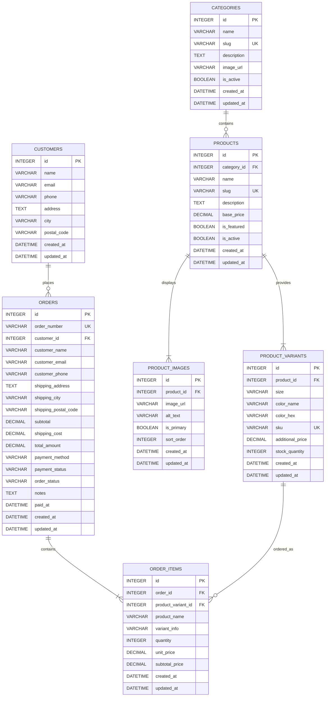
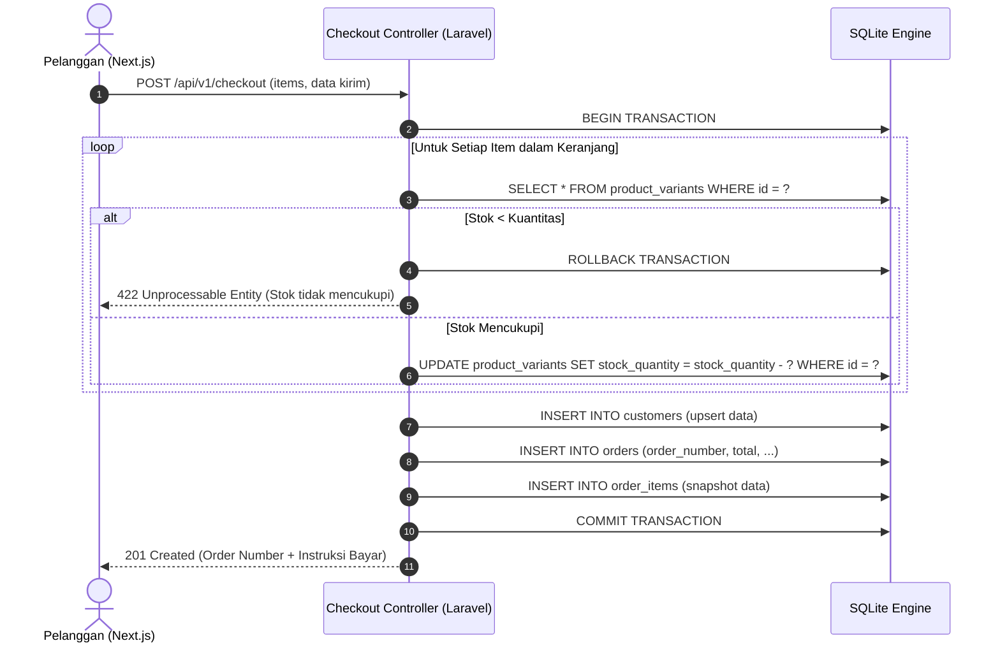

# Technical Architecture Document
## Project: Stars Merch Web Platform
**Document Version:** 1.0.0  
**Author:** Supervisor Agent (Lead System Architect)  
**Status:** Approved Architecture Draft  
**Reference Document:** [PRD.md](file:///D:/stars_merch/PRD.md)  

---

## 1. Ringkasan Eksekutif Arsitektur

Dokumen ini mendefinisikan desain teknis detail untuk platform **Stars Merch**, mencakup:
1. **Desain Skema Database Relasional (SQLite / Eloquent ORM)** yang dioptimasi untuk performa pencarian katalog dan integritas transaksi checkout.
2. **Spesifikasi Kontrak RESTful API** antara Backend (Laravel 12) dan Frontend (Next.js 15).
3. **Pola Integrasi & Keamanan Data** untuk alur checkout atomik, validasi stok, serta penanganan error terstandar.

---

## 2. Desain Skema Database (Database Schema)

Database menggunakan **SQLite** (`database.sqlite`) dengan dukungan *foreign key constraints* diaktifkan (`PRAGMA foreign_keys = ON;`). Skema dirancang ternormalisasi tingkat 3NF dengan pertimbangan *read-heavy* pada katalog produk dan integritas transaksi ACID pada pemrosesan pesanan.

### 2.1 Entity Relationship Diagram (ERD)



---

### 2.2 Spesifikasi Detail Tabel & Indexing

#### A. Tabel `categories`
Menyimpan kelompok kategori pakaian (misal: *Oversized T-Shirts*, *Hoodies & Sweaters*, *Pants*, *Accessories*).

| Kolom | Tipe Data | Constraint | Deskripsi |
| :--- | :--- | :--- | :--- |
| `id` | `INTEGER` | `PRIMARY KEY AUTOINCREMENT` | ID unik kategori |
| `name` | `VARCHAR(100)` | `NOT NULL` | Nama kategori (misal: "Oversized Tees") |
| `slug` | `VARCHAR(120)` | `UNIQUE, NOT NULL` | URL-friendly slug (misal: "oversized-tees") |
| `description` | `TEXT` | `NULLABLE` | Deskripsi singkat kategori |
| `image_url` | `VARCHAR(255)` | `NULLABLE` | Banner / thumbnail representasi kategori |
| `is_active` | `BOOLEAN` | `DEFAULT 1, NOT NULL` | Status aktif/tampil |
| `created_at` | `DATETIME` | `NOT NULL` | Timestamp pembuatan |
| `updated_at` | `DATETIME` | `NOT NULL` | Timestamp pembaruan |

* **Index**:
  * `idx_categories_slug` (`slug` UNIQUE)
  * `idx_categories_active` (`is_active`)

---

#### B. Tabel `products`
Menyimpan data master pakaian Stars Merch.

| Kolom | Tipe Data | Constraint | Deskripsi |
| :--- | :--- | :--- | :--- |
| `id` | `INTEGER` | `PRIMARY KEY AUTOINCREMENT` | ID unik produk |
| `category_id` | `INTEGER` | `NOT NULL, FK -> categories(id) ON DELETE RESTRICT` | Kategori produk |
| `name` | `VARCHAR(150)` | `NOT NULL` | Nama produk (misal: "Stars Acid-Wash Vintage Tee") |
| `slug` | `VARCHAR(180)` | `UNIQUE, NOT NULL` | URL identifier (misal: "stars-acid-wash-vintage-tee") |
| `description` | `TEXT` | `NOT NULL` | Spesifikasi bahan, fit, dan instruksi perawatan |
| `base_price` | `DECIMAL(12,2)`| `NOT NULL` | Harga dasar (dalam IDR, misal: 189000.00) |
| `is_featured`| `BOOLEAN` | `DEFAULT 0, NOT NULL` | Ditampilkan pada Hero/Featured section |
| `is_active`  | `BOOLEAN` | `DEFAULT 1, NOT NULL` | Status publikasi |
| `created_at` | `DATETIME` | `NOT NULL` | Timestamp pembuatan |
| `updated_at` | `DATETIME` | `NOT NULL` | Timestamp pembaruan |

* **Index**:
  * `idx_products_slug` (`slug` UNIQUE)
  * `idx_products_cat_active` (`category_id`, `is_active`)
  * `idx_products_featured` (`is_featured`, `is_active`)

---

#### C. Tabel `product_images`
Menyimpan galeri foto produk (tampak depan, tampak belakang, detail bahan, lookbook).

| Kolom | Tipe Data | Constraint | Deskripsi |
| :--- | :--- | :--- | :--- |
| `id` | `INTEGER` | `PRIMARY KEY AUTOINCREMENT` | ID unik gambar |
| `product_id` | `INTEGER` | `NOT NULL, FK -> products(id) ON DELETE CASCADE` | Relasi ke produk |
| `image_url` | `VARCHAR(255)` | `NOT NULL` | Path atau URL gambar (misal: `/images/products/tee-front.webp`) |
| `alt_text` | `VARCHAR(150)` | `NULLABLE` | Teks alternatif untuk SEO & aksesibilitas |
| `is_primary` | `BOOLEAN` | `DEFAULT 0, NOT NULL` | Menandakan gambar utama untuk thumbnail katalog |
| `sort_order` | `INTEGER` | `DEFAULT 0, NOT NULL` | Urutan tampilan galeri |
| `created_at` | `DATETIME` | `NOT NULL` | Timestamp |
| `updated_at` | `DATETIME` | `NOT NULL` | Timestamp |

* **Index**:
  * `idx_images_product_primary` (`product_id`, `is_primary`, `sort_order`)

---

#### D. Tabel `product_variants`
Menyimpan kombinasi ukuran (*size*) dan warna (*color*) beserta stok spesifik per SKU.

| Kolom | Tipe Data | Constraint | Deskripsi |
| :--- | :--- | :--- | :--- |
| `id` | `INTEGER` | `PRIMARY KEY AUTOINCREMENT` | ID unik varian |
| `product_id` | `INTEGER` | `NOT NULL, FK -> products(id) ON DELETE CASCADE` | Relasi ke produk |
| `size` | `VARCHAR(10)` | `NOT NULL` | Ukuran (`S`, `M`, `L`, `XL`, `XXL`) |
| `color_name` | `VARCHAR(50)` | `NOT NULL` | Nama warna (misal: "Vintage Charcoal", "Sand Beige") |
| `color_hex` | `VARCHAR(7)` | `NOT NULL` | Kode warna HEX untuk swatch UI (misal: `#2F3542`) |
| `sku` | `VARCHAR(50)` | `UNIQUE, NOT NULL` | Stock Keeping Unit (misal: `STM-TEE-VINT-BLK-L`) |
| `additional_price` | `DECIMAL(10,2)`| `DEFAULT 0.00, NOT NULL` | Tambahan harga jika ada (misal: XXL +Rp15.000) |
| `stock_quantity` | `INTEGER` | `DEFAULT 0, NOT NULL` | Jumlah sisa stok fisik |
| `created_at` | `DATETIME` | `NOT NULL` | Timestamp |
| `updated_at` | `DATETIME` | `NOT NULL` | Timestamp |

* **Index**:
  * `idx_variants_sku` (`sku` UNIQUE)
  * `idx_variants_product` (`product_id`)
  * `idx_variants_stock` (`product_id`, `stock_quantity`)

---

#### E. Tabel `customers`
Menyimpan profil pelanggan (baik tamu yang checkout maupun pelanggan terdaftar untuk riwayat pemesanan).

| Kolom | Tipe Data | Constraint | Deskripsi |
| :--- | :--- | :--- | :--- |
| `id` | `INTEGER` | `PRIMARY KEY AUTOINCREMENT` | ID unik pelanggan |
| `name` | `VARCHAR(120)` | `NOT NULL` | Nama lengkap pelanggan |
| `email` | `VARCHAR(150)` | `NOT NULL` | Alamat email (penerima konfirmasi pesanan) |
| `phone` | `VARCHAR(30)` | `NOT NULL` | Nomor kontak / WhatsApp |
| `address` | `TEXT` | `NOT NULL` | Alamat tempat tinggal / pengiriman default |
| `city` | `VARCHAR(100)` | `NOT NULL` | Kota / Kabupaten |
| `postal_code` | `VARCHAR(10)` | `NOT NULL` | Kode pos |
| `created_at` | `DATETIME` | `NOT NULL` | Timestamp |
| `updated_at` | `DATETIME` | `NOT NULL` | Timestamp |

* **Index**:
  * `idx_customers_email` (`email`)
  * `idx_customers_phone` (`phone`)

---

#### F. Tabel `orders`
Menyimpan data transaksi pemesanan pakaian.

| Kolom | Tipe Data | Constraint | Deskripsi |
| :--- | :--- | :--- | :--- |
| `id` | `INTEGER` | `PRIMARY KEY AUTOINCREMENT` | ID internal pesanan |
| `order_number` | `VARCHAR(30)` | `UNIQUE, NOT NULL` | Nomor referensi pesanan (misal: `STM-202610-0089`) |
| `customer_id` | `INTEGER` | `NULLABLE, FK -> customers(id) ON DELETE SET NULL` | Relasi ke profil customer |
| `customer_name` | `VARCHAR(120)` | `NOT NULL` | Snapshot nama pemesan saat transaksi |
| `customer_email`| `VARCHAR(150)` | `NOT NULL` | Snapshot email pemesan |
| `customer_phone`| `VARCHAR(30)` | `NOT NULL` | Snapshot no. telepon |
| `shipping_address`| `TEXT` | `NOT NULL` | Snapshot alamat pengiriman lengkap |
| `shipping_city` | `VARCHAR(100)` | `NOT NULL` | Kota tujuan |
| `shipping_postal_code`| `VARCHAR(10)`| `NOT NULL` | Kode pos |
| `subtotal` | `DECIMAL(12,2)`| `NOT NULL` | Total harga barang murni |
| `shipping_cost`| `DECIMAL(10,2)`| `DEFAULT 0.00, NOT NULL` | Biaya ongkos kirim flat/dihitung |
| `total_amount` | `DECIMAL(12,2)`| `NOT NULL` | Total akhir (`subtotal + shipping_cost`) |
| `payment_method` | `VARCHAR(50)` | `NOT NULL` | `bank_transfer_bca`, `bank_transfer_mandiri`, `cod` |
| `payment_status` | `VARCHAR(30)` | `DEFAULT 'pending', NOT NULL` | `pending`, `paid`, `cancelled`, `refunded` |
| `order_status` | `VARCHAR(30)` | `DEFAULT 'unprocessed', NOT NULL` | `unprocessed`, `processing`, `shipped`, `completed`, `cancelled` |
| `notes` | `TEXT` | `NULLABLE` | Catatan khusus dari pembeli |
| `paid_at` | `DATETIME` | `NULLABLE` | Waktu konfirmasi pembayaran |
| `created_at` | `DATETIME` | `NOT NULL` | Waktu order dibuat |
| `updated_at` | `DATETIME` | `NOT NULL` | Waktu update status |

* **Index**:
  * `idx_orders_order_number` (`order_number` UNIQUE)
  * `idx_orders_customer_lookup` (`customer_email`, `order_number`)
  * `idx_orders_status` (`order_status`, `payment_status`)

---

#### G. Tabel `order_items`
Snapshot produk dan varian yang dibeli pada sebuah order (anti-perubahan historis jika harga produk master berubah kelak).

| Kolom | Tipe Data | Constraint | Deskripsi |
| :--- | :--- | :--- | :--- |
| `id` | `INTEGER` | `PRIMARY KEY AUTOINCREMENT` | ID item pesanan |
| `order_id` | `INTEGER` | `NOT NULL, FK -> orders(id) ON DELETE CASCADE` | Relasi ke pesanan |
| `product_variant_id` | `INTEGER` | `NULLABLE, FK -> product_variants(id) ON DELETE SET NULL` | Relasi varian asal |
| `product_name` | `VARCHAR(150)` | `NOT NULL` | Snapshot nama produk |
| `variant_info` | `VARCHAR(100)` | `NOT NULL` | Snapshot deskripsi varian (misal: "Size XL / Vintage Black") |
| `quantity` | `INTEGER` | `NOT NULL` | Jumlah item yang dibeli |
| `unit_price` | `DECIMAL(12,2)`| `NOT NULL` | Harga satuan saat checkout |
| `subtotal_price`| `DECIMAL(12,2)`| `NOT NULL` | `unit_price * quantity` |
| `created_at` | `DATETIME` | `NOT NULL` | Timestamp |
| `updated_at` | `DATETIME` | `NOT NULL` | Timestamp |

* **Index**:
  * `idx_order_items_order` (`order_id`)
  * `idx_order_items_variant` (`product_variant_id`)

---

## 3. Spesifikasi Kontrak RESTful API (Backend - Frontend)

Semua endpoint beroperasi di bawah base URI `/api/v1/` dengan header:
* `Accept: application/json`
* `Content-Type: application/json`

### 3.1 Standar Format Response JSON

#### A. Response Sukses (200 / 201)
```json
{
  "success": true,
  "statusCode": 200,
  "message": "Operasi berhasil.",
  "data": {},
  "meta": {
    "page": 1,
    "limit": 12,
    "total": 48,
    "total_pages": 4
  }
}
```

#### B. Response Error (400 / 404 / 422 / 500)
```json
{
  "success": false,
  "statusCode": 422,
  "error": {
    "code": "VALIDATION_FAILED",
    "message": "Data yang dikirim tidak valid.",
    "details": {
      "customer_email": ["Format email tidak valid."],
      "items.0.quantity": ["Stok varian tidak mencukupi."]
    }
  }
}
```

---

### 3.2 Katalog & Produk Endpoints

#### 1. List Kategori
* **Endpoint**: `GET /api/v1/categories`
* **Deskripsi**: Mengambil semua kategori aktif untuk navigasi navbar dan filter katalog.
* **Response**:
```json
{
  "success": true,
  "statusCode": 200,
  "data": [
    {
      "id": 1,
      "name": "Oversized T-Shirts",
      "slug": "oversized-tees",
      "description": "Heavyweight cotton oversized tees",
      "image_url": "/images/categories/oversized.webp",
      "products_count": 8
    }
  ]
}
```

---

#### 2. List Produk (Katalog dengan Filter, Sort, & Pagination)
* **Endpoint**: `GET /api/v1/products`
* **Query Parameters**:
  * `category` (string, optional): Slug kategori (misal: `oversized-tees`).
  * `search` (string, optional): Kata kunci nama/deskripsi produk.
  * `sort` (string, optional): `newest` (default), `price_asc`, `price_desc`.
  * `page` (integer, optional): Nomor halaman (default: `1`).
  * `per_page` (integer, optional): Jumlah item per halaman (default: `12`).
* **Response**:
```json
{
  "success": true,
  "statusCode": 200,
  "data": [
    {
      "id": 10,
      "name": "Stars Cosmic Heavy Tee",
      "slug": "stars-cosmic-heavy-tee",
      "category": {
        "id": 1,
        "name": "Oversized T-Shirts",
        "slug": "oversized-tees"
      },
      "base_price": 199000,
      "primary_image": "/images/products/cosmic-black-front.webp",
      "available_sizes": ["S", "M", "L", "XL"],
      "available_colors": [
        { "name": "Cosmic Black", "hex": "#1E1E24" },
        { "name": "Washed Grey", "hex": "#707070" }
      ],
      "total_stock": 45,
      "is_featured": true
    }
  ],
  "meta": {
    "page": 1,
    "limit": 12,
    "total": 24,
    "total_pages": 2
  }
}
```

---

#### 3. Featured Products (Untuk Landing Page Hero Section)
* **Endpoint**: `GET /api/v1/products/featured`
* **Deskripsi**: Mengambil daftar produk pilihan/terlaris untuk carousel atau showcase di beranda (maksimal 4-8 item).
* **Response**: Berisi array objek produk ringkas dengan flag `is_featured: true`.

---

#### 4. Detail Produk (Product Detail Page)
* **Endpoint**: `GET /api/v1/products/{slug}`
* **Deskripsi**: Mengambil data lengkap satu produk beserta seluruh galeri gambar dan daftar varian (ukuran, warna, stok real-time).
* **Response**:
```json
{
  "success": true,
  "statusCode": 200,
  "data": {
    "id": 10,
    "name": "Stars Cosmic Heavy Tee",
    "slug": "stars-cosmic-heavy-tee",
    "description": "T-shirt bergaya streetwear dengan potongan boxy-oversized menggunakan bahan 100% 24s Heavy Cotton (240 GSM).",
    "base_price": 199000,
    "category": {
      "id": 1,
      "name": "Oversized T-Shirts",
      "slug": "oversized-tees"
    },
    "images": [
      { "id": 1, "image_url": "/images/products/cosmic-black-front.webp", "alt_text": "Tampak Depan", "is_primary": true },
      { "id": 2, "image_url": "/images/products/cosmic-black-back.webp", "alt_text": "Tampak Belakang", "is_primary": false }
    ],
    "variants": [
      {
        "id": 101,
        "size": "S",
        "color_name": "Cosmic Black",
        "color_hex": "#1E1E24",
        "sku": "STM-CSM-BLK-S",
        "price": 199000,
        "stock": 12
      },
      {
        "id": 102,
        "size": "M",
        "color_name": "Cosmic Black",
        "color_hex": "#1E1E24",
        "sku": "STM-CSM-BLK-M",
        "price": 199000,
        "stock": 0
      },
      {
        "id": 103,
        "size": "L",
        "color_name": "Cosmic Black",
        "color_hex": "#1E1E24",
        "sku": "STM-CSM-BLK-L",
        "price": 199000,
        "stock": 8
      },
      {
        "id": 104,
        "size": "XL",
        "color_name": "Cosmic Black",
        "color_hex": "#1E1E24",
        "sku": "STM-CSM-BLK-XL",
        "price": 209000,
        "stock": 4
      }
    ]
  }
}
```

---

### 3.3 Keranjang Belanja & Validasi Stok

#### 5. Validasi Isi Keranjang
* **Endpoint**: `POST /api/v1/cart/validate`
* **Deskripsi**: Dipanggil oleh frontend Next.js saat membuka keranjang atau sebelum masuk halaman checkout untuk memastikan harga tidak berubah dan stok masih ada.
* **Request Body**:
```json
{
  "items": [
    { "variant_id": 101, "quantity": 2 },
    { "variant_id": 104, "quantity": 1 }
  ]
}
```
* **Response**:
```json
{
  "success": true,
  "statusCode": 200,
  "data": {
    "is_valid": true,
    "items": [
      {
        "variant_id": 101,
        "product_name": "Stars Cosmic Heavy Tee",
        "variant_info": "Size S / Cosmic Black",
        "quantity": 2,
        "unit_price": 199000,
        "subtotal": 398000,
        "available_stock": 12,
        "in_stock": true
      },
      {
        "variant_id": 104,
        "product_name": "Stars Cosmic Heavy Tee",
        "variant_info": "Size XL / Cosmic Black",
        "quantity": 1,
        "unit_price": 209000,
        "subtotal": 209000,
        "available_stock": 4,
        "in_stock": true
      }
    ],
    "subtotal": 607000,
    "estimated_shipping": 20000,
    "grand_total": 627000
  }
}
```

---

### 3.4 Checkout & Manajemen Pesanan

#### 6. Eksekusi Checkout Pesanan
* **Endpoint**: `POST /api/v1/checkout`
* **Deskripsi**: Memproses pesanan secara atomik, memvalidasi dan memotong stok varian di database, serta menghasilkan nomor invoice.
* **Request Body**:
```json
{
  "customer_name": "Rian Pratama",
  "customer_email": "rian.pratama@example.com",
  "customer_phone": "081298765432",
  "shipping_address": "Jl. Senopati No. 88, Kebayoran Baru",
  "shipping_city": "Jakarta Selatan",
  "shipping_postal_code": "12190",
  "payment_method": "bank_transfer_bca",
  "notes": "Tolong packing double bubble wrap",
  "items": [
    { "variant_id": 101, "quantity": 2 },
    { "variant_id": 104, "quantity": 1 }
  ]
}
```
* **Response (201 Created)**:
```json
{
  "success": true,
  "statusCode": 201,
  "message": "Pesanan berhasil dibuat. Silakan lakukan pembayaran.",
  "data": {
    "order_number": "STM-202610-0012",
    "total_amount": 627000,
    "payment_method": "bank_transfer_bca",
    "payment_status": "pending",
    "order_status": "unprocessed",
    "payment_instructions": {
      "bank_name": "Bank Central Asia (BCA)",
      "account_number": "8720-1928-31",
      "account_holder": "PT STARS MERCH INDONESIA",
      "unique_code": 12,
      "transfer_amount": 627012,
      "deadline": "2026-10-02T23:59:59+07:00"
    }
  }
}
```

---

#### 7. Cek Status Pesanan Publik (Order Confirmation / Tracking)
* **Endpoint**: `GET /api/v1/orders/{order_number}`
* **Query Parameters**:
  * `email` (string, required untuk privasi): Email pemesan yang sesuai.
* **Deskripsi**: Digunakan di halaman konfirmasi sukses (`/checkout/success?order=...`) dan halaman lacak pesanan.
* **Response**:
```json
{
  "success": true,
  "statusCode": 200,
  "data": {
    "order_number": "STM-202610-0012",
    "created_at": "2026-10-01T23:55:00+07:00",
    "customer": {
      "name": "Rian Pratama",
      "email": "rian.pratama@example.com",
      "phone": "081298765432"
    },
    "shipping": {
      "address": "Jl. Senopati No. 88, Kebayoran Baru",
      "city": "Jakarta Selatan",
      "postal_code": "12190"
    },
    "items": [
      {
        "product_name": "Stars Cosmic Heavy Tee",
        "variant_info": "Size S / Cosmic Black",
        "quantity": 2,
        "unit_price": 199000,
        "subtotal": 398000
      },
      {
        "product_name": "Stars Cosmic Heavy Tee",
        "variant_info": "Size XL / Cosmic Black",
        "quantity": 1,
        "unit_price": 209000,
        "subtotal": 209000
      }
    ],
    "pricing": {
      "subtotal": 607000,
      "shipping_cost": 20000,
      "total_amount": 627000
    },
    "payment_method": "bank_transfer_bca",
    "payment_status": "pending",
    "order_status": "unprocessed"
  }
}
```

---

## 4. Mekanisme Integritas Transaksi & Validasi Stok

Untuk mencegah *race condition* (misal: dua pelanggan checkout varian kaos terakhir secara bersamaan), controller checkout pada Laravel 12 **wajib** mengimplementasikan mekanisme *database transaction* dan *pessimistic locking*:



---

## 5. Ringkasan Tugas Implementasi Backend & Frontend

### Modul Backend (Laravel 12):
1. **Migration & Models**: `Category`, `Product`, `ProductImage`, `ProductVariant`, `Customer`, `Order`, `OrderItem`.
2. **Seeders**: Data demo 8 pakaian lengkap dengan gambar dummy, varian warna/ukuran, dan stok.
3. **Controllers & Resources**:
   - `CategoryController.php` -> `CategoryResource.php`
   - `ProductController.php` -> `ProductResource.php`, `ProductDetailResource.php`
   - `CartValidationController.php`
   - `CheckoutController.php` (dengan `CheckoutRequest.php` untuk validasi input dan `DB::transaction`).

### Modul Frontend (Next.js 15):
1. **API Client Helper**: Wrapper `fetch` dengan base URL `http://127.0.0.1:8000/api/v1` dan typing TypeScript otomatis.
2. **Zustand Cart Store**: Menyimpan array item `{ variantId, productId, name, size, color, price, quantity, image }` tersinkronisasi dengan `localStorage`.
3. **UI Views**:
   - Beranda (`/`): Hero + Featured Products (`GET /api/v1/products/featured`).
   - Katalog (`/catalog`): Filter kategori, sortir harga, grid produk.
   - Detail Produk (`/product/[slug]`): Swatch warna, tombol ukuran, live stock guard.
   - Cart Drawer: Komponen melayang dengan validasi kuantitas.
   - Checkout Page (`/checkout`): Formulir alamat dan pemilihan metode pembayaran dasar.
   - Success Page (`/checkout/success`): Menampilkan detail invoice order.
