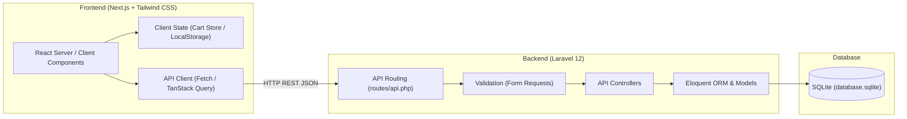
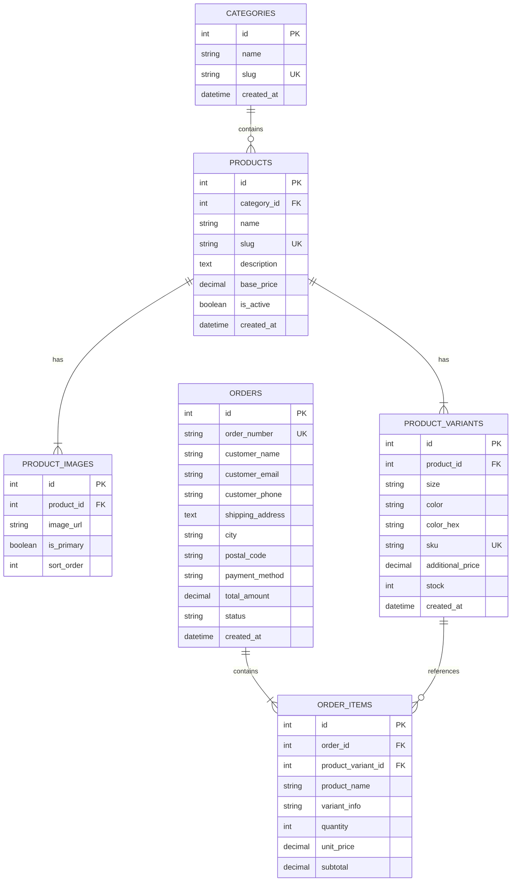

# Product Requirements Document (PRD)
## Project: Stars Merch Web Platform
**Document Version:** 1.0.0  
**Author:** Supervisor Agent (Lead System Architect)  
**Status:** Approved / Ready for Implementation  
**Target Delivery:** MVP (Minimum Viable Product)  

---

## 1. Executive Summary & Product Vision

### 1.1 Visi Produk
**Stars Merch** adalah platform e-commerce direct-to-consumer (D2C) untuk clothing brand modern. Platform ini dirancang untuk memberikan pengalaman berbelanja yang cepat, responsif, dan estetik dengan fokus utama pada produk pakaian (t-shirt, hoodie, jaket, dan aksesori merchandise).

### 1.2 Tujuan MVP
* Menghadirkan identitas brand yang kuat melalui Halaman Utama (Hero Section).
* Menyediakan navigasi katalog pakaian yang intuitif dengan pemfilteran berbasis kategori.
* Menyajikan halaman detail produk (PDP) interaktif dengan pemilihan ukuran (*size*) dan warna (*color*).
* Menyediakan keranjang belanja (*shopping cart*) yang persisten di sisi klien.
* Mengimplementasikan alur checkout dasar yang andal untuk memproses pesanan dan mencatatnya ke database backend.

---

## 2. Arsitektur Sistem & Tech Stack

Sistem dirancang menggunakan arsitektur *decoupled* (Headless E-commerce) di mana Frontend dan Backend terpisah secara fisik dan berkomunikasi secara eksklusif melalui protokol HTTP RESTful API.



### 2.1 Spesifikasi Teknologi

| Komponen | Teknologi | Keterangan |
| :--- | :--- | :--- |
| **Frontend Framework** | Next.js (App Router, React 19) | Server-Side Rendering (SSR) & Static Generation (SSG/ISR) untuk SEO & performa tinggi |
| **Styling Engine** | Tailwind CSS | Utility-first CSS untuk desain modern, konsisten, dan responsif |
| **Icons & UI Kit** | Lucide React | Ikon modern dan ringan |
| **State Management** | Zustand | Manajemen state keranjang belanja dengan sinkronisasi `localStorage` |
| **Backend Framework** | Laravel 12 | RESTful API backend, penanganan logika bisnis, dan validasi transaksi |
| **Database** | SQLite (`database.sqlite`) | Database file-based yang cepat, zero-configuration, cocok untuk development dan MVP |
| **Data Serialization** | Laravel API Resources | Standarisasi JSON payload response |

---

## 3. Kebutuhan Fungsional (Functional Requirements)

### 3.1 Modul 1: Halaman Utama (Hero Section & Landing Page)
* **FR-1.1 Hero Banner**: Banner visual dinamis dengan *headline* promosi brand, sub-headline, dan tombol Call-to-Action (CTA) "Shop Collection" yang mengarahkan user langsung ke katalog.
* **FR-1.2 Featured Collections**: Bagian yang menampilkan 3-4 kategori unggulan (misal: *Oversized Tees*, *Hoodies*, *Limited Edition*).
* **FR-1.3 Value Propositions / USP**: Tiga pilar layanan (Bahan Premium 100% Cotton, Pengiriman Cepat, Garansi Retur Ukuran).
* **FR-1.4 Footer**: Informasi hak cipta, media sosial, FAQ, dan panduan ukuran (*size chart modal trigger*).

### 3.2 Modul 2: Katalog Pakaian (Product Catalog & Browsing)
* **FR-2.1 Grid Produk**: Layout grid responsif (4 kolom desktop, 2 kolom mobile) menampilkan kartu produk: gambar utama, nama produk, kategori, harga dasar, dan tag status (misal: *Best Seller*, *New Arrival*).
* **FR-2.2 Filter Kategori**: Filter tab/dropdown berdasarkan kategori pakaian (*All*, *T-Shirts*, *Hoodies*, *Pants*, *Accessories*).
* **FR-2.3 Sorting Produk**: Pengurutan produk berdasarkan: Terbaru, Harga Terendah, Harga Tertinggi.
* **FR-2.4 Search Box**: Pencarian instan berdasarkan nama atau deskripsi produk.

### 3.3 Modul 3: Halaman Detail Produk (Product Detail Page / PDP)
* **FR-3.1 Galeri Produk**: Tampilan gambar utama beresolusi tinggi dengan thumbnail gambar varian.
* **FR-3.2 Pemilihan Varian Ukuran**: Pilihan ukuran interaktif (`S`, `M`, `L`, `XL`, `XXL`). Ukuran yang habis stoknya (*sold out*) otomatis dinonaktifkan (*disabled* dengan coretan).
* **FR-3.3 Pemilihan Varian Warna**: Swatch visual pilihan warna (misal: *Midnight Black*, *Off-White*, *Sage Green*).
* **FR-3.4 Dynamic Stock & Price Indicator**: Harga dan ketersediaan stok terupdate dinamis saat kombinasi ukuran dan warna dipilih.
* **FR-3.5 Tombol Aksi**:
  * Input kuantitas barang (+/-).
  * Tombol "Add to Cart" dengan umpan balik visual (toast / cart drawer otomatis terbuka).

### 3.4 Modul 4: Keranjang Belanja (Shopping Cart System)
* **FR-4.1 Cart Drawer & Cart Page**: Akses cepat via floating/navbar cart icon yang membuka panel samping (*side drawer*) atau halaman penuh.
* **FR-4.2 Persistent Cart**: State keranjang tersimpan di `localStorage` browser sehingga tidak hilang saat halaman direfresh.
* **FR-4.3 Informasi Item Keranjang**: Menampilkan thumbnail, nama produk, varian terpilih (Ukuran & Warna), harga satuan, subtotal per item, dan pemilih kuantitas.
* **FR-4.4 Modifikasi Item**: Kemampuan mengubah jumlah item atau menghapus item langsung dari keranjang.
* **FR-4.5 Ringkasan Pembayaran**: Kalkulasi otomatis Subtotal, Estimasi Pajak/Biaya Layanan, dan Total Tagihan.

### 3.5 Modul 5: Sistem Checkout Dasar (Basic Checkout System)
* **FR-5.1 Formulir Informasi Pelanggan**:
  * Nama Lengkap
  * Alamat Email
  * Nomor WhatsApp / Telepon
* **FR-5.2 Informasi Pengiriman**:
  * Alamat Lengkap
  * Kota / Kabupaten & Kode Pos
  * Catatan Tambahan untuk Pengiriman
* **FR-5.3 Pilihan Pembayaran Dasar**:
  * Transfer Bank Manual (BCA, Mandiri, BNI, BRI)
  * Cash on Delivery (COD)
* **FR-5.4 Submit Pesanan & Pengurangan Stok**:
  * Backend memvalidasi ketersediaan stok sebelum pesanan dibuat secara atomik.
  * Backend membuat nomor invoice unik (misal: `STM-202610-001`).
* **FR-5.5 Halaman Konfirmasi Pesanan (Success Page)**:
  * Menampilkan nomor pesanan, detail rekening pembayaran (jika transfer bank), ringkasan item yang dibeli, dan tombol kembali ke beranda.

---

## 4. Desain Database & Skema Relasional (SQLite)

Database menggunakan engine SQLite di Laravel 12 dengan skema ternormalisasi:



---

## 5. Rencana & Kontrak Integrasi API (Frontend - Backend)

Semua endpoint backend Laravel diawali dengan prefix `/api/v1/`.

### 5.1 Endpoint Produk
* `GET /api/v1/products`
  * **Query Params**: `category` (slug), `sort` (`newest`, `price_asc`, `price_desc`), `search` (string).
  * **Response**: List produk beserta gambar utama dan rentang harga.
* `GET /api/v1/products/{slug}`
  * **Response**: Objek produk lengkap beserta relasi `category`, `images`, dan array `variants` (stok, size, color).

### 5.2 Endpoint Keranjang & Validasi Stok
* `POST /api/v1/cart/validate`
  * **Request Body**:
    ```json
    {
      "items": [
        { "variant_id": 1, "quantity": 2 },
        { "variant_id": 5, "quantity": 1 }
      ]
    }
    ```
  * **Response**: Validasi harga terbaru dan konfirmasi kecukupan stok setiap varian.

### 5.3 Endpoint Checkout
* `POST /api/v1/checkout`
  * **Request Body**:
    ```json
    {
      "customer_name": "Budi Santoso",
      "customer_email": "budi@example.com",
      "customer_phone": "081234567890",
      "shipping_address": "Jl. Bintang Timur No. 45",
      "city": "Jakarta Selatan",
      "postal_code": "12340",
      "payment_method": "manual_bank_transfer",
      "items": [
        { "variant_id": 1, "quantity": 2 }
      ]
    }
    ```
  * **Response (201 Created)**:
    ```json
    {
      "success": true,
      "message": "Pesanan berhasil dibuat.",
      "data": {
        "order_number": "STM-202610-0001",
        "total_amount": 350000,
        "payment_method": "manual_bank_transfer",
        "payment_instructions": {
          "bank": "BCA",
          "account_number": "8720192831",
          "account_holder": "PT Stars Merch Indonesia"
        }
      }
    }
    ```

* `GET /api/v1/orders/{order_number}`
  * **Response**: Informasi detail status pesanan untuk halaman konfirmasi.

---

## 6. Kebutuhan Non-Fungsional (Non-Functional Requirements)

1. **Performa & Kecepatan**:
   * Halaman katalog dan detail produk Next.js harus mengoptimalkan Core Web Vitals (LCP < 2.5s) dengan memanfaatkan `next/image` untuk kompresi aset gambar.
2. **Keamanan**:
   * Konfigurasi CORS pada Laravel `config/cors.php` membatasi domain akses hanya untuk host Next.js (`localhost:3000` pada environment dev).
   * Validasi ketat di sisi server via Laravel Form Requests untuk mencegah data malformed atau kuantitas negatif.
   * Transaksi database (`DB::transaction`) saat checkout guna menghindari *race condition* pada pemotongan stok.
3. **Desain & Aksesibilitas**:
   * Mobile-first responsive layout (kompatibel dari layar 360px hingga 4K desktop).
   * Feedback visual yang jelas untuk setiap aksi pengguna (*loading skeleton*, *toast notifications*, *form error highlights*).

---

## 7. Rencana Kerja & Daftar Tugas (Engineering Roadmap)

### Milestone 1: Backend Foundation (Laravel 12 + SQLite)
* [x] **Issue BE-01**: Inisialisasi proyek Laravel 12 & konfigurasi database SQLite.
* [x] **Issue BE-02**: Pembuatan migration database (`categories`, `products`, `product_images`, `product_variants`, `orders`, `order_items`).
* [x] **Issue BE-03**: Pembuatan Database Seeder dengan sampel produk pakaian Stars Merch (kaos, hoodie, varian ukuran & warna).
* [x] **Issue BE-04**: Implementasi Controller & Resource untuk Product Catalog & Detail API.
* [x] **Issue BE-05**: Implementasi Checkout Controller dengan validasi stok atomik via DB Transaction.

### Milestone 2: Frontend Foundation & UI Setup (Next.js + Tailwind)
* [x] **Issue FE-01**: Inisialisasi proyek Next.js dengan Tailwind CSS dan Lucide React.
* [x] **Issue FE-02**: Setup Global Layout (Navbar dengan badge jumlah keranjang, Footer brand, Cart Drawer, dan Modal Size Chart).
* [x] **Issue FE-03**: Implementasi Halaman Utama (Hero Section, Value Proposition, Featured Collections).

### Milestone 3: Catalog & Product Detail Integration
* [x] **Issue FE-04**: Halaman Katalog Pakaian (Grid Produk, Filter Kategori, Sorting).
* [x] **Issue FE-05**: Halaman Detail Produk (Galeri gambar, Pemilih Ukuran & Warna, Stok real-time, Tombol Tambah ke Keranjang).

### Milestone 4: Cart & Checkout Flow
* [x] **Issue FE-06**: Implementasi State Keranjang Belanja via Zustand terhubung ke `localStorage` + UI Cart Drawer & Dedicated Cart Page.
* [x] **Issue FE-07**: Halaman Checkout (Form alamat pengiriman, opsi pembayaran, ringkasan pesanan).
* [x] **Issue FE-08**: Integrasi submit checkout ke API Backend Laravel & Halaman Sukses Pesanan.

### Milestone 5: Testing, QA & Polish
* [ ] **Issue QA-01**: Pengujian alur belanja *end-to-end* (Pilih baju -> Pilih varian -> Masuk keranjang -> Checkout -> Verifikasi pengurangan stok di SQLite).
* [ ] **Issue QA-02**: Validasi responsivitas mobile & optimasi performa gambar.

---

### 7.1 Catatan Teknis & Perubahan dari Rencana Awal (Technical Notes)

#### A. Backend (Issue BE-03)
1. **Modular Seeder Architecture**:
   - Seeder dipecah secara modular menjadi `CategorySeeder.php` dan `ProductSeeder.php`, dipanggil via orchestrator `DatabaseSeeder.php`.
   - Menggunakan metode `updateOrCreate` untuk menjaga sifat *idempotent* sehingga seeder aman dijalankan berulang kali tanpa risiko duplikasi data SKU atau slug.
2. **Kelengkapan Data Demo**:
   - Mengisi 4 kategori master: *Oversized T-Shirts*, *Hoodies & Sweaters*, *Pants & Cargo*, dan *Accessories*.
   - Mengisi katalog produk lengkap dengan deskripsi streetwear detail (tipe GSM, material cotton), relasi gambar ganda (tampak depan/belakang) via URL CDN Unsplash, varian ukuran (`S`, `M`, `L`, `XL`, `XXL`), kode warna HEX asli, dan variasi stok (termasuk stok `0` untuk skenario uji batas/sold out).

#### B. Frontend (Issue FE-02)
1. **Pemisahan Komponen Layout & Global Overlays**:
   - Komponen layout utama distrukturisasi rapi di folder `src/components/layout/` (`Navbar.tsx`, `Footer.tsx`), `src/components/cart/` (`CartDrawer.tsx`), dan `src/components/modals/` (`SizeChartModal.tsx`).
2. **Penambahan Modal Panduan Ukuran & State Khusus**:
   - Untuk memenuhi kebutuhan [FR-1.4](file:///D:/Stars_merch/PRD.md#L76) secara elegan, ditambahkan state management baru `src/store/useSizeChartStore.ts` berbasis Zustand agar Modal Size Chart dapat dipicu dari Footer, Navbar, maupun Halaman Detail Produk kelak.
3. **Penyatuan Komponen di Root Layout**:
   - File `src/app/layout.tsx` diperbarui untuk merender `<Navbar />`, `<CartDrawer />`, dan `<SizeChartModal />` secara konsisten di seluruh route aplikasi dengan styling responsif Tailwind CSS v4.
4. **Utility Functions**:
   - Ditambahkan `src/lib/utils.ts` berisi formatter mata uang terstandar `formatRupiah()` untuk format angka harga IDR.

#### C. Backend (Issue BE-04)
1. **RESTful Catalog & Detail APIs**:
   - Diimplementasikan `CategoryController` dengan `CategoryResource` untuk `GET /api/v1/categories`.
   - Diimplementasikan `ProductController` dengan `ProductResource` dan `ProductDetailResource` untuk `GET /api/v1/products` (mendukung filter `category`, `search`, sorting `newest`/`price_asc`/`price_desc`, pagination), `GET /api/v1/products/featured`, dan `GET /api/v1/products/{slug}`.
2. **CORS & Automated Tests**:
   - Konfigurasi `config/cors.php` untuk mengizinkan origin frontend `http://localhost:3000`.
   - Dibuat automated feature test suite `tests/Feature/CatalogApiTest.php` dengan 8 skenario pengujian komprehensif (246 assertions, passing 100%).

#### D. Frontend (Issue FE-03)
1. **Modular Home Components**:
   - Halaman `src/app/page.tsx` diimplementasikan dengan komponen modular di `src/components/home/`: `HeroSection.tsx`, `ValuePropositions.tsx`, `FeaturedCollections.tsx`, dan `FeaturedProducts.tsx`.
2. **Optimasi Aset Gambar (next/image)**:
   - Menambahkan konfigurasi remote patterns `images.unsplash.com` di `next.config.ts`.
3. **Resilient Data Fetching**:
   - Komponen `FeaturedProducts` mengintegrasikan API client `api.products.getFeatured()` dengan UI skeleton loading dan error/empty fallback handling.

#### E. Backend (Issue BE-05)
1. **Validasi Keranjang & Transaksi Atomik Checkout**:
   - Diimplementasikan `CartValidationController` (`POST /api/v1/cart/validate`) dengan `ValidateCartRequest`.
   - Diimplementasikan `CheckoutController` (`POST /api/v1/checkout`, `GET /api/v1/orders/{order_number}`) dengan `CheckoutRequest`.
   - Menggunakan `DB::transaction` untuk memastikan pembuatan invoice order, item pesanan, dan pemotongan stok varian (`decrement`) dieksekusi secara atomik untuk mencegah *race condition*.
2. **Feature Tests**:
   - Dibuat `tests/Feature/CheckoutApiTest.php` mencakup validasi stok, error handling 422, atomisitas checkout, dan tracking pesanan publik (7 passed).

#### F. Frontend (Issue FE-04)
1. **Halaman Katalog Komprehensif (`src/app/catalog/page.tsx`)**:
   - Menghadirkan layout grid produk responsif (4 kolom desktop, 2 kolom mobile).
   - Fitur filter tab kategori dinamis, pencarian instan (*search input*), dan dropdown pengurutan (*sorting* harga & terbaru).
2. **Graceful Fallback & Mock Dataset**:
   - Penambahan `src/lib/mockData.ts` dan logic fallback pada `src/lib/api.ts` agar halaman katalog tetap berfungsi dan menampilkan data estetis ketika backend sedang offline.

#### G. Frontend (Issue FE-05)
1. **Halaman Detail Produk / PDP (`src/app/product/[slug]/page.tsx`)**:
   - Dynamic Static Site Generation (SSG) dengan `generateStaticParams` untuk pra-render semua rute produk saat build.
   - Komponen modular di `src/components/product/`: `ProductDetailView.tsx`, `ProductGallery.tsx`, `VariantSelector.tsx`, dan `ProductStockIndicator.tsx`.
   - Swatch visual pilihan warna (nama & hex code), pemilih ukuran interaktif dengan coretan otomatis jika ukuran habis (*sold out*), indikator stok fisik real-time, serta tombol "Add to Cart" yang terintegrasi dengan Zustand cart store.

#### H. Frontend (Issue FE-06)
1. **Dedicated Cart Page (`src/app/cart/page.tsx`) & Cart Drawer**:
   - Penyediaan dua akses keranjang belanja: panel geser melayang (*Cart Drawer*) dan halaman penuh (*Dedicated Cart Page*) dengan komponen `CartPageView.tsx`.
   - Ringkasan belanja dinamis: subtotal, estimasi ongkir otomatis (bebas ongkir untuk pesanan di atas Rp 300.000), kontrol kuantitas (+/-), penghapusan item, dan tombol navigasi langsung ke alur checkout.

#### I. Frontend (Issue FE-07 & FE-08)
1. **Halaman Checkout (`src/app/checkout/page.tsx`)**:
   - Komponen modular di `src/components/checkout/`: `CheckoutView.tsx`, `CheckoutForm.tsx`, `OrderSummary.tsx`.
   - Formulir lengkap identitas pembeli (nama, email, nomor WhatsApp), rincian pengiriman (alamat, kota, kode pos), opsi metode pembayaran (Transfer Bank BCA/Mandiri atau COD), dan field catatan kurir.
2. **Integrasi Transaksi & Halaman Sukses (`src/app/checkout/success/page.tsx`)**:
   - Terintegrasi langsung dengan API backend `POST /api/v1/checkout` melalui helper `api.checkout.submit()`.
   - Pembersihan keranjang belanja otomatis (`useCartStore.clearCart()`) setelah submit order sukses.
   - Halaman konfirmasi sukses (`SuccessView.tsx`) menampilkan nomor invoice pesanan (`order_number`), instruksi rekening pembayaran lengkap dengan fitur salin nomor rekening, serta tracking data order via `api.orders.getDetails()`.
