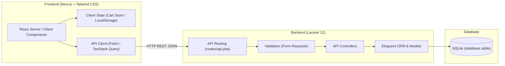
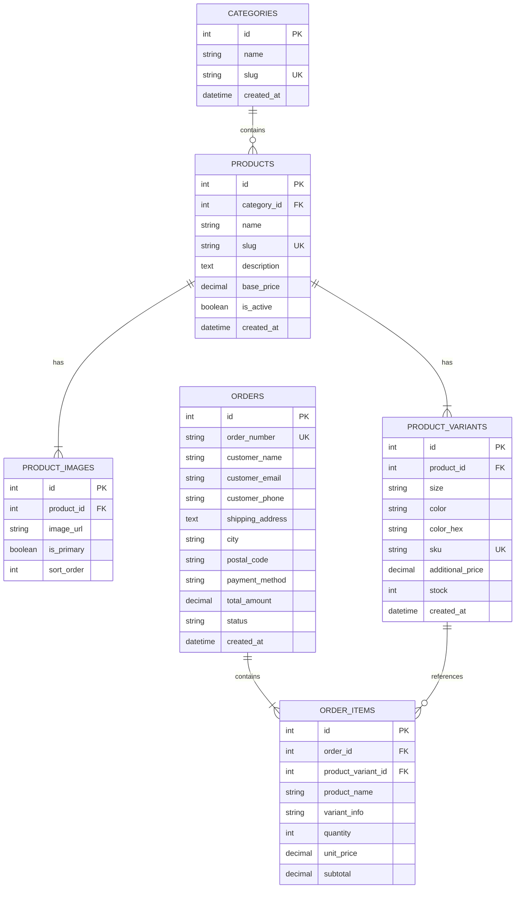

# Product Requirements Document (PRD)
## Project: Stars Merch Web Platform
**Document Version:** 1.1.0  
**Author:** Supervisor Agent (Lead System Architect)  
**Status:** Approved / Extended for Admin Portal  
**Target Delivery:** MVP & Phase 1.1 (Storefront & Admin Product Management)  

---

## 1. Executive Summary & Product Vision

### 1.1 Visi Produk
**Stars Merch** adalah platform e-commerce direct-to-consumer (D2C) untuk clothing brand modern. Platform ini dirancang untuk memberikan pengalaman berbelanja yang cepat, responsif, dan estetik dengan fokus utama pada produk pakaian (t-shirt, hoodie, jaket, dan aksesori merchandise).

### 1.2 Tujuan MVP & Rilis v1.1.0
* Menghadirkan identitas brand yang kuat melalui Halaman Utama (Hero Section).
* Menyediakan navigasi katalog pakaian yang intuitif dengan pemfilteran berbasis kategori.
* Menyajikan halaman detail produk (PDP) interaktif dengan pemilihan ukuran (*size*) dan warna (*color*).
* Menyediakan keranjang belanja (*shopping cart*) yang persisten di sisi klien.
* Mengimplementasikan alur checkout dasar yang andal untuk memproses pesanan dan mencatatnya ke database backend.
* **[v1.1.0] Admin Portal & Manajemen Produk**: Menyediakan portal terproteksi bagi admin untuk login aman (Laravel Sanctum) dan menambahkan produk pakaian baru (termasuk galeri foto, varian ukuran/warna HEX, penetapan harga, dan kuantitas stok fisik) langsung ke katalog toko secara realtime.

---

## 2. Arsitektur Sistem & Tech Stack

Sistem dirancang menggunakan arsitektur *decoupled* (Headless E-commerce) di mana Frontend dan Backend terpisah secara fisik dan berkomunikasi secara eksklusif melalui protokol HTTP RESTful API.



### 2.1 Spesifikasi Teknologi

| Komponen | Teknologi | Keterangan |
| :--- | :--- | :--- |
| **Frontend Framework** | Next.js (App Router, React 19) | Server-Side Rendering (SSR) & Static Generation (SSG/ISR) untuk SEO & performa tinggi |
| **Styling Engine** | Tailwind CSS | Utility-first CSS untuk desain modern, konsisten, dan responsif |
| **Icons & UI Kit** | Lucide React | Ikon modern dan ringan |
| **State Management** | Zustand | Manajemen state keranjang belanja dengan sinkronisasi `localStorage` |
| **Backend Framework** | Laravel 12 | RESTful API backend, penanganan logika bisnis, dan validasi transaksi |
| **Database** | SQLite (`database.sqlite`) | Database file-based yang cepat, zero-configuration, cocok untuk development dan MVP |
| **Data Serialization** | Laravel API Resources | Standarisasi JSON payload response |

---

## 3. Kebutuhan Fungsional (Functional Requirements)

### 3.1 Modul 1: Halaman Utama (Hero Section & Landing Page)
* **FR-1.1 Hero Banner**: Banner visual dinamis dengan *headline* promosi brand, sub-headline, dan tombol Call-to-Action (CTA) "Shop Collection" yang mengarahkan user langsung ke katalog.
* **FR-1.2 Featured Collections**: Bagian yang menampilkan 3-4 kategori unggulan (misal: *Oversized Tees*, *Hoodies*, *Limited Edition*).
* **FR-1.3 Value Propositions / USP**: Tiga pilar layanan (Bahan Premium 100% Cotton, Pengiriman Cepat, Garansi Retur Ukuran).
* **FR-1.4 Footer**: Informasi hak cipta, media sosial, FAQ, panduan ukuran (*size chart modal trigger*), serta tautan akses cepat ke portal admin.
* **FR-1.5 Tombol Akses Login Website Utama (Main Storefront Login Action)**: Tombol/ikon navigasi login pada navbar website utama (desktop dan menu hamburger mobile) untuk memfasilitasi akses staf/admin ke halaman login (`/admin/login`). Memiliki status interaktif responsif: menampilkan tombol "Login / Masuk" dengan ikon user saat tamu belum terotentikasi, atau beralih menjadi badge "Admin Portal / Dashboard" saat sesi login aktif terdeteksi.

### 3.2 Modul 2: Katalog Pakaian (Product Catalog & Browsing)
* **FR-2.1 Grid Produk**: Layout grid responsif (4 kolom desktop, 2 kolom mobile) menampilkan kartu produk: gambar utama, nama produk, kategori, harga dasar, dan tag status (misal: *Best Seller*, *New Arrival*).
* **FR-2.2 Filter Kategori**: Filter tab/dropdown berdasarkan kategori pakaian (*All*, *T-Shirts*, *Hoodies*, *Pants*, *Accessories*).
* **FR-2.3 Sorting Produk**: Pengurutan produk berdasarkan: Terbaru, Harga Terendah, Harga Tertinggi.
* **FR-2.4 Search Box**: Pencarian instan berdasarkan nama atau deskripsi produk.

### 3.3 Modul 3: Halaman Detail Produk (Product Detail Page / PDP)
* **FR-3.1 Galeri Produk**: Tampilan gambar utama beresolusi tinggi dengan thumbnail gambar varian.
* **FR-3.2 Pemilihan Varian Ukuran**: Pilihan ukuran interaktif (`S`, `M`, `L`, `XL`, `XXL`). Ukuran yang habis stoknya (*sold out*) otomatis dinonaktifkan (*disabled* dengan coretan).
* **FR-3.3 Pemilihan Varian Warna**: Swatch visual pilihan warna (misal: *Midnight Black*, *Off-White*, *Sage Green*).
* **FR-3.4 Dynamic Stock & Price Indicator**: Harga dan ketersediaan stok terupdate dinamis saat kombinasi ukuran dan warna dipilih.
* **FR-3.5 Tombol Aksi**:
  * Input kuantitas barang (+/-).
  * Tombol "Add to Cart" dengan umpan balik visual (toast / cart drawer otomatis terbuka).

### 3.4 Modul 4: Keranjang Belanja (Shopping Cart System)
* **FR-4.1 Cart Drawer & Cart Page**: Akses cepat via floating/navbar cart icon yang membuka panel samping (*side drawer*) atau halaman penuh.
* **FR-4.2 Persistent Cart**: State keranjang tersimpan di `localStorage` browser sehingga tidak hilang saat halaman direfresh.
* **FR-4.3 Informasi Item Keranjang**: Menampilkan thumbnail, nama produk, varian terpilih (Ukuran & Warna), harga satuan, subtotal per item, dan pemilih kuantitas.
* **FR-4.4 Modifikasi Item**: Kemampuan mengubah jumlah item atau menghapus item langsung dari keranjang.
* **FR-4.5 Ringkasan Pembayaran**: Kalkulasi otomatis Subtotal, Estimasi Pajak/Biaya Layanan, dan Total Tagihan.

### 3.5 Modul 5: Sistem Checkout Dasar (Basic Checkout System)
* **FR-5.1 Formulir Informasi Pelanggan**:
  * Nama Lengkap
  * Alamat Email
  * Nomor WhatsApp / Telepon
* **FR-5.2 Informasi Pengiriman**:
  * Alamat Lengkap
  * Kota / Kabupaten & Kode Pos
  * Catatan Tambahan untuk Pengiriman
* **FR-5.3 Pilihan Pembayaran Dasar**:
  * Transfer Bank Manual (BCA, Mandiri, BNI, BRI)
  * Cash on Delivery (COD)
* **FR-5.4 Submit Pesanan & Pengurangan Stok**:
  * Backend memvalidasi ketersediaan stok sebelum pesanan dibuat secara atomik.
  * Backend membuat nomor invoice unik (misal: `STM-202610-001`).
* **FR-5.5 Halaman Konfirmasi Pesanan (Success Page)**:
  * Menampilkan nomor pesanan, detail rekening pembayaran (jika transfer bank), ringkasan item yang dibeli, dan tombol kembali ke beranda.

### 3.6 Modul 6: Admin Portal & Manajemen Produk Pakaian (Product Management)
* **FR-6.1 Autentikasi Admin (Login & Session Guard)**:
  * Halaman login khusus admin di `/admin/login` dengan formulir email, password, dan proteksi kredensial.
  * Autentikasi berbasis token aman via API Laravel Sanctum yang mengembalikan bearer token untuk sesi admin.
  * Route Guard / Middleware pada Next.js untuk memproteksi seluruh rute `/admin/*` dari akses publik, serta auto-redirect ke `/admin/login` jika belum terotentikasi.
  * Tombol Logout di header admin untuk mencabut (*revoke*) token aktif.
* **FR-6.2 Dashboard Manajemen Produk Admin (`/admin/products`)**:
  * Menampilkan tabel inventaris seluruh katalog pakaian dengan thumbnail gambar utama, nama produk, kategori, harga dasar, akumulasi total stok seluruh varian, dan status publikasi (`Active` / `Draft`).
  * Filter cepat berdasarkan kategori dan pencarian nama produk.
  * Tombol navigasi aksi: Tambah Produk Baru, Edit, atau Toggle status aktif produk.
* **FR-6.3 Formulir Tambah Produk Baru (`/admin/products/new`)**:
  * **Informasi Produk**:
    * Nama Produk (otomatis men-generate slug URL ramah SEO).
    * Dropdown Kategori (terintegrasi dinamis dengan API kategori: *Oversized T-Shirts*, *Hoodies & Sweaters*, *Pants & Cargo*, *Accessories*).
    * Deskripsi Produk (material bahan 100% Cotton, GSM, model potongan boxy/oversized, petunjuk perawatan).
    * Harga Dasar (`base_price` format IDR).
    * Checkbox / Toggle: *Publish Immediately* (`is_active`) dan *Featured on Homepage* (`is_featured`).
  * **Galeri Foto Produk**:
    * Penambahan multiple gambar foto produk (tampak depan, belakang, close-up bahan).
    * Penentuan gambar primer (`is_primary`) untuk thumbnail etalase katalog.
    * Input teks alternatif (*alt text*) untuk optimasi aksesibilitas dan SEO.
  * **Generator & Matriks Varian Pakaian (Size & Color Matrix)**:
    * Pilihan ukuran fleksibel: `S`, `M`, `L`, `XL`, `XXL`.
    * Nama warna (misal: *Cosmic Black*, *Vintage Charcoal*, *Sand Beige*) dan kode HEX visual swatch (misal: `#1E1E24`).
    * Pembuatan SKU unik otomatis (format: `STM-{SLUG}-{COLOR}-{SIZE}`).
    * Tambahan harga per varian (`additional_price`, default `0`).
    * Input jumlah kuantitas stok fisik awal (`stock_quantity`) per kombinasi SKU.
* **FR-6.4 Integritas Penyimpanan & Validasi Atomik**:
  * Backend memvalidasi integritas data master, gambar, dan varian secara menyeluruh (mencegah SKU kembar atau kuantitas negatif).
  * Penyimpanan atomik menggunakan `DB::transaction` (memastikan tabel `products`, `product_images`, dan `product_variants` tersimpan utuh bersamaan).
  * Produk baru yang berhasil disimpan langsung terbit dan dapat dicari di katalog publik (`/catalog`) serta dapat dimasukkan ke keranjang belanja oleh pelanggan.
* **FR-6.5 Tombol Akses Login Terintegrasi pada Website Utama**:
  * Menghadirkan tombol akses login di Navbar etalase publik (sebelah ikon pencarian/panduan ukuran dan di menu navigasi mobile) dengan ikon user (`Lucide User`).
  * Integrasi deteksi status otentikasi: ketika belum login mengarahkan ke `/admin/login`; ketika admin telah login menampilkan status akun aktif dan akses sekali-klik ke `/admin/products`.
  * Penempatan tautan "Admin Portal" di bagian Footer etalase publik untuk aksesibilitas backoffice yang rapi.

---

## 4. Desain Database & Skema Relasional (SQLite)

Database menggunakan engine SQLite di Laravel 12 dengan skema ternormalisasi:



---

## 5. Rencana & Kontrak Integrasi API (Frontend - Backend)

Semua endpoint backend Laravel diawali dengan prefix `/api/v1/`.

### 5.1 Endpoint Produk
* `GET /api/v1/products`
  * **Query Params**: `category` (slug), `sort` (`newest`, `price_asc`, `price_desc`), `search` (string).
  * **Response**: List produk beserta gambar utama dan rentang harga.
* `GET /api/v1/products/{slug}`
  * **Response**: Objek produk lengkap beserta relasi `category`, `images`, dan array `variants` (stok, size, color).

### 5.2 Endpoint Keranjang & Validasi Stok
* `POST /api/v1/cart/validate`
  * **Request Body**:
    ```json
    {
      "items": [
        { "variant_id": 1, "quantity": 2 },
        { "variant_id": 5, "quantity": 1 }
      ]
    }
    ```
  * **Response**: Validasi harga terbaru dan konfirmasi kecukupan stok setiap varian.

### 5.3 Endpoint Checkout
* `POST /api/v1/checkout`
  * **Request Body**:
    ```json
    {
      "customer_name": "Budi Santoso",
      "customer_email": "budi@example.com",
      "customer_phone": "081234567890",
      "shipping_address": "Jl. Bintang Timur No. 45",
      "city": "Jakarta Selatan",
      "postal_code": "12340",
      "payment_method": "manual_bank_transfer",
      "items": [
        { "variant_id": 1, "quantity": 2 }
      ]
    }
    ```
  * **Response (201 Created)**:
    ```json
    {
      "success": true,
      "message": "Pesanan berhasil dibuat.",
      "data": {
        "order_number": "STM-202610-0001",
        "total_amount": 350000,
        "payment_method": "manual_bank_transfer",
        "payment_instructions": {
          "bank": "BCA",
          "account_number": "8720192831",
          "account_holder": "PT Stars Merch Indonesia"
        }
      }
    }
    ```

* `GET /api/v1/orders/{order_number}`
  * **Response**: Informasi detail status pesanan untuk halaman konfirmasi.

### 5.4 Endpoint Admin (Autentikasi & Manajemen Produk)

Semua endpoint admin diawali dengan prefix `/api/v1/admin/`. Endpoint manajemen produk wajib menyertakan header `Authorization: Bearer <sanctum_token>`.

#### 1. Login Admin
* `POST /api/v1/admin/login`
  * **Request Body**:
    ```json
    {
      "email": "admin@starsmerch.com",
      "password": "secretpassword"
    }
    ```
  * **Response (200 OK)**:
    ```json
    {
      "success": true,
      "message": "Login berhasil.",
      "data": {
        "token": "1|sanctum_auth_token_string_here",
        "user": {
          "id": 1,
          "name": "Admin Stars Merch",
          "email": "admin@starsmerch.com",
          "role": "admin"
        }
      }
    }
    ```

#### 2. Profil Admin & Logout
* `GET /api/v1/admin/me`: Mengecek keabsahan sesi login aktif.
* `POST /api/v1/admin/logout`: Mencabut (*revoke*) token aktif pengguna.

#### 3. Tambah Produk Baru (Create Product with Images & Variants)
* `POST /api/v1/admin/products`
  * **Headers**: `Authorization: Bearer <token>`, `Accept: application/json`
  * **Request Body**:
    ```json
    {
      "category_id": 1,
      "name": "Stars Cyberpunk Acid Hoodie",
      "description": "Heavyweight French Terry Cotton 400 GSM dengan grafis streetwear cyberpunk.",
      "base_price": 389000,
      "is_featured": true,
      "is_active": true,
      "images": [
        {
          "image_url": "https://images.unsplash.com/photo-1556905055-8f358a7a47b2",
          "alt_text": "Stars Cyberpunk Acid Hoodie Tampak Depan",
          "is_primary": true,
          "sort_order": 0
        },
        {
          "image_url": "https://images.unsplash.com/photo-1556905055-8f358a7a47b3",
          "alt_text": "Stars Cyberpunk Acid Hoodie Tampak Belakang",
          "is_primary": false,
          "sort_order": 1
        }
      ],
      "variants": [
        {
          "size": "M",
          "color_name": "Acid Washed Grey",
          "color_hex": "#4A4E69",
          "sku": "STM-HD-CYBER-GRY-M",
          "additional_price": 0,
          "stock_quantity": 25
        },
        {
          "size": "L",
          "color_name": "Acid Washed Grey",
          "color_hex": "#4A4E69",
          "sku": "STM-HD-CYBER-GRY-L",
          "additional_price": 0,
          "stock_quantity": 30
        },
        {
          "size": "XL",
          "color_name": "Acid Washed Grey",
          "color_hex": "#4A4E69",
          "sku": "STM-HD-CYBER-GRY-XL",
          "additional_price": 15000,
          "stock_quantity": 15
        }
      ]
    }
    ```
  * **Response (201 Created)**:
    ```json
    {
      "success": true,
      "message": "Produk pakaian dan varian berhasil ditambahkan.",
      "data": {
        "id": 11,
        "name": "Stars Cyberpunk Acid Hoodie",
        "slug": "stars-cyberpunk-acid-hoodie",
        "base_price": 389000,
        "category": { "id": 1, "name": "Hoodies & Sweaters" },
        "images_count": 2,
        "variants_count": 3,
        "total_stock": 70
      }
    }
    ```

#### 4. List Produk Admin (Semua Status)
* `GET /api/v1/admin/products`
  * Mendukung pagination, filter `category`, filter status publikasi (`all`, `active`, `draft`), dan kata kunci pencarian `search`.

---

## 6. Kebutuhan Non-Fungsional (Non-Functional Requirements)

1. **Performa & Kecepatan**:
   * Halaman katalog dan detail produk Next.js harus mengoptimalkan Core Web Vitals (LCP < 2.5s) dengan memanfaatkan `next/image` untuk kompresi aset gambar.
2. **Keamanan**:
   * Konfigurasi CORS pada Laravel `config/cors.php` membatasi domain akses hanya untuk host Next.js (`localhost:3000` pada environment dev).
   * Validasi ketat di sisi server via Laravel Form Requests untuk mencegah data malformed atau kuantitas negatif.
   * Transaksi database (`DB::transaction`) saat checkout guna menghindari *race condition* pada pemotongan stok.
3. **Desain & Aksesibilitas**:
   * Mobile-first responsive layout (kompatibel dari layar 360px hingga 4K desktop).
   * Feedback visual yang jelas untuk setiap aksi pengguna (*loading skeleton*, *toast notifications*, *form error highlights*).

---

## 7. Rencana Kerja & Daftar Tugas (Engineering Roadmap)

### Milestone 1: Backend Foundation (Laravel 12 + SQLite)
* [x] **Issue BE-01**: Inisialisasi proyek Laravel 12 & konfigurasi database SQLite.
* [x] **Issue BE-02**: Pembuatan migration database (`categories`, `products`, `product_images`, `product_variants`, `orders`, `order_items`).
* [x] **Issue BE-03**: Pembuatan Database Seeder dengan sampel produk pakaian Stars Merch (kaos, hoodie, varian ukuran & warna).
* [x] **Issue BE-04**: Implementasi Controller & Resource untuk Product Catalog & Detail API.
* [x] **Issue BE-05**: Implementasi Checkout Controller dengan validasi stok atomik via DB Transaction.

### Milestone 2: Frontend Foundation & UI Setup (Next.js + Tailwind)
* [x] **Issue FE-01**: Inisialisasi proyek Next.js dengan Tailwind CSS dan Lucide React.
* [x] **Issue FE-02**: Setup Global Layout (Navbar dengan badge jumlah keranjang, Footer brand, Cart Drawer, dan Modal Size Chart).
* [x] **Issue FE-03**: Implementasi Halaman Utama (Hero Section, Value Proposition, Featured Collections).

### Milestone 3: Catalog & Product Detail Integration
* [x] **Issue FE-04**: Halaman Katalog Pakaian (Grid Produk, Filter Kategori, Sorting).
* [x] **Issue FE-05**: Halaman Detail Produk (Galeri gambar, Pemilih Ukuran & Warna, Stok real-time, Tombol Tambah ke Keranjang).

### Milestone 4: Cart & Checkout Flow
* [x] **Issue FE-06**: Implementasi State Keranjang Belanja via Zustand terhubung ke `localStorage` + UI Cart Drawer & Dedicated Cart Page.
* [x] **Issue FE-07**: Halaman Checkout (Form alamat pengiriman, opsi pembayaran, ringkasan pesanan).
* [x] **Issue FE-08**: Integrasi submit checkout ke API Backend Laravel & Halaman Sukses Pesanan.

### Milestone 5: Testing, QA & Polish
* [x] **Issue QA-01**: Pengujian alur belanja *end-to-end* (Pilih baju -> Pilih varian -> Masuk keranjang -> Checkout -> Verifikasi pengurangan stok di SQLite).
* [x] **Issue QA-02**: Validasi responsivitas mobile & optimasi performa gambar.

### Milestone 6: Admin Portal & Product Management (Laravel Sanctum + Next.js Admin UI)
* [x] **Issue BE-06**: Autentikasi Admin Laravel Sanctum, seeder akun admin default, dan middleware proteksi rute `/api/v1/admin/*`. (Selesai)
* [x] **Issue BE-07**: REST API Admin Product Management (Store Product dengan gambar & varian atomik via `DB::transaction`, list produk, dan validasi duplikasi SKU). (Selesai)
* [x] **Issue FE-09**: Halaman Login Admin (`/admin/login`), State Autentikasi Admin via Zustand/Cookie, dan Protected Route Guard. (Selesai)
* [x] **Issue FE-10**: Dashboard Admin Produk (`/admin/products`) & Formulir Tambah Produk Baru (`/admin/products/new`) dengan visual variant matrix builder. (Selesai)
* [x] **Issue QA-03**: Automated Feature Tests Backend Admin API & Verifikasi Penambahan Produk Baru Muncul Real-time di Katalog Storefront. (Selesai)
* [ ] **Issue FE-11**: Implementasi Tombol Login di Website Utama (Storefront Navbar & Footer) dengan Indikator Status Sesi (Tamu / Admin).

---

### 7.1 Catatan Teknis & Perubahan dari Rencana Awal (Technical Notes)

#### A. Backend (Issue BE-03)
1. **Modular Seeder Architecture**:
   - Seeder dipecah secara modular menjadi `CategorySeeder.php` dan `ProductSeeder.php`, dipanggil via orchestrator `DatabaseSeeder.php`.
   - Menggunakan metode `updateOrCreate` untuk menjaga sifat *idempotent* sehingga seeder aman dijalankan berulang kali tanpa risiko duplikasi data SKU atau slug.
2. **Kelengkapan Data Demo**:
   - Mengisi 4 kategori master: *Oversized T-Shirts*, *Hoodies & Sweaters*, *Pants & Cargo*, dan *Accessories*.
   - Mengisi katalog produk lengkap dengan deskripsi streetwear detail (tipe GSM, material cotton), relasi gambar ganda (tampak depan/belakang) via URL CDN Unsplash, varian ukuran (`S`, `M`, `L`, `XL`, `XXL`), kode warna HEX asli, dan variasi stok (termasuk stok `0` untuk skenario uji batas/sold out).

#### B. Frontend (Issue FE-02)
1. **Pemisahan Komponen Layout & Global Overlays**:
   - Komponen layout utama distrukturisasi rapi di folder `src/components/layout/` (`Navbar.tsx`, `Footer.tsx`), `src/components/cart/` (`CartDrawer.tsx`), dan `src/components/modals/` (`SizeChartModal.tsx`).
2. **Penambahan Modal Panduan Ukuran & State Khusus**:
   - Untuk memenuhi kebutuhan [FR-1.4](file:///D:/Stars_merch/PRD.md#L76) secara elegan, ditambahkan state management baru `src/store/useSizeChartStore.ts` berbasis Zustand agar Modal Size Chart dapat dipicu dari Footer, Navbar, maupun Halaman Detail Produk kelak.
3. **Penyatuan Komponen di Root Layout**:
   - File `src/app/layout.tsx` diperbarui untuk merender `<Navbar />`, `<CartDrawer />`, dan `<SizeChartModal />` secara konsisten di seluruh route aplikasi dengan styling responsif Tailwind CSS v4.
4. **Utility Functions**:
   - Ditambahkan `src/lib/utils.ts` berisi formatter mata uang terstandar `formatRupiah()` untuk format angka harga IDR.

#### C. Backend (Issue BE-04)
1. **RESTful Catalog & Detail APIs**:
   - Diimplementasikan `CategoryController` dengan `CategoryResource` untuk `GET /api/v1/categories`.
   - Diimplementasikan `ProductController` dengan `ProductResource` dan `ProductDetailResource` untuk `GET /api/v1/products` (mendukung filter `category`, `search`, sorting `newest`/`price_asc`/`price_desc`, pagination), `GET /api/v1/products/featured`, dan `GET /api/v1/products/{slug}`.
2. **CORS & Automated Tests**:
   - Konfigurasi `config/cors.php` untuk mengizinkan origin frontend `http://localhost:3000`.
   - Dibuat automated feature test suite `tests/Feature/CatalogApiTest.php` dengan 8 skenario pengujian komprehensif (246 assertions, passing 100%).

#### D. Frontend (Issue FE-03)
1. **Modular Home Components**:
   - Halaman `src/app/page.tsx` diimplementasikan dengan komponen modular di `src/components/home/`: `HeroSection.tsx`, `ValuePropositions.tsx`, `FeaturedCollections.tsx`, dan `FeaturedProducts.tsx`.
2. **Optimasi Aset Gambar (next/image)**:
   - Menambahkan konfigurasi remote patterns `images.unsplash.com` di `next.config.ts`.
3. **Resilient Data Fetching**:
   - Komponen `FeaturedProducts` mengintegrasikan API client `api.products.getFeatured()` dengan UI skeleton loading dan error/empty fallback handling.

#### E. Backend (Issue BE-05)
1. **Validasi Keranjang & Transaksi Atomik Checkout**:
   - Diimplementasikan `CartValidationController` (`POST /api/v1/cart/validate`) dengan `ValidateCartRequest`.
   - Diimplementasikan `CheckoutController` (`POST /api/v1/checkout`, `GET /api/v1/orders/{order_number}`) dengan `CheckoutRequest`.
   - Menggunakan `DB::transaction` untuk memastikan pembuatan invoice order, item pesanan, dan pemotongan stok varian (`decrement`) dieksekusi secara atomik untuk mencegah *race condition*.
2. **Feature Tests**:
   - Dibuat `tests/Feature/CheckoutApiTest.php` mencakup validasi stok, error handling 422, atomisitas checkout, dan tracking pesanan publik (7 passed).

#### F. Frontend (Issue FE-04)
1. **Halaman Katalog Komprehensif (`src/app/catalog/page.tsx`)**:
   - Menghadirkan layout grid produk responsif (4 kolom desktop, 2 kolom mobile).
   - Fitur filter tab kategori dinamis, pencarian instan (*search input*), dan dropdown pengurutan (*sorting* harga & terbaru).
2. **Graceful Fallback & Mock Dataset**:
   - Penambahan `src/lib/mockData.ts` dan logic fallback pada `src/lib/api.ts` agar halaman katalog tetap berfungsi dan menampilkan data estetis ketika backend sedang offline.

#### G. Frontend (Issue FE-05)
1. **Halaman Detail Produk / PDP (`src/app/product/[slug]/page.tsx`)**:
   - Dynamic Static Site Generation (SSG) dengan `generateStaticParams` untuk pra-render semua rute produk saat build.
   - Komponen modular di `src/components/product/`: `ProductDetailView.tsx`, `ProductGallery.tsx`, `VariantSelector.tsx`, dan `ProductStockIndicator.tsx`.
   - Swatch visual pilihan warna (nama & hex code), pemilih ukuran interaktif dengan coretan otomatis jika ukuran habis (*sold out*), indikator stok fisik real-time, serta tombol "Add to Cart" yang terintegrasi dengan Zustand cart store.

#### H. Frontend (Issue FE-06)
1. **Dedicated Cart Page (`src/app/cart/page.tsx`) & Cart Drawer**:
   - Penyediaan dua akses keranjang belanja: panel geser melayang (*Cart Drawer*) dan halaman penuh (*Dedicated Cart Page*) dengan komponen `CartPageView.tsx`.
   - Ringkasan belanja dinamis: subtotal, estimasi ongkir otomatis (bebas ongkir untuk pesanan di atas Rp 300.000), kontrol kuantitas (+/-), penghapusan item, dan tombol navigasi langsung ke alur checkout.

#### I. Frontend (Issue FE-07 & FE-08)
1. **Halaman Checkout (`src/app/checkout/page.tsx`)**:
   - Komponen modular di `src/components/checkout/`: `CheckoutView.tsx`, `CheckoutForm.tsx`, `OrderSummary.tsx`.
   - Formulir lengkap identitas pembeli (nama, email, nomor WhatsApp), rincian pengiriman (alamat, kota, kode pos), opsi metode pembayaran (Transfer Bank BCA/Mandiri atau COD), dan field catatan kurir.
2. **Integrasi Transaksi & Halaman Sukses (`src/app/checkout/success/page.tsx`)**:
   - Terintegrasi langsung dengan API backend `POST /api/v1/checkout` melalui helper `api.checkout.submit()`.
   - Pembersihan keranjang belanja otomatis (`useCartStore.clearCart()`) setelah submit order sukses.
   - Halaman konfirmasi sukses (`SuccessView.tsx`) menampilkan nomor invoice pesanan (`order_number`), instruksi rekening pembayaran lengkap dengan fitur salin nomor rekening, serta tracking data order via `api.orders.getDetails()`.

#### J. Quality Assurance & Polish (Issue QA-01 & QA-02)
1. **End-to-End Shopping & Inventory Decrement Test (Issue QA-01)**:
   - Dibuat automated feature test suite `tests/Feature/EndToEndShoppingFlowTest.php` yang mensimulasikan alur pengguna penuh:
     1. Eksplorasi produk featured pada beranda (`GET /api/v1/products/featured`).
     2. Filter katalog kategori dan pencarian nama pakaian (`GET /api/v1/products?category=...&search=...`).
     3. Pembukaan halaman PDP detail produk (`GET /api/v1/products/{slug}`).
     4. Validasi keranjang belanja (`POST /api/v1/cart/validate`).
     5. Eksekusi transaksi checkout pesanan (`POST /api/v1/checkout`).
     6. Verifikasi database SQLite: Order tersimpan, customer record terbuat, dan pengurangan stok fisik varian terjadi secara atomik via `DB::transaction`.
     7. Verifikasi pelacakan pesanan publik (`GET /api/v1/orders/{order_number}?email=...`).
     8. Pengujian batas stok (mencegah checkout saat kuantitas melebihi sisa stok fisik).
   - Seluruh automated test suite backend: **18 test cases lolos 100% (361 assertions)**.
   - Uji coba langsung pada physical file `database.sqlite` berhasil mengonfirmasi ACID transaction dan atomicity lock.
2. **Mobile Responsiveness & Core Web Vitals Optimization (Issue QA-02)**:
   - Layout mobile-first responsif divalidasi pada rentang resolusi 360px (mobile compact) hingga 4K desktop (grid 2-kolom mobile, 4-kolom desktop; single-column form checkout; drawer geser; modal responsif).
   - Optimasi gambar via `next/image` dengan atribut `priority` pada elemen LCP utama, `sizes` terukur per breakpoint, serta aspect ratio eksplisit untuk meniadakan Cumulative Layout Shift (CLS = 0).
   - Static caching & pre-rendering: 16 rute statis dan SSG berhasil digenerate saat build dalam waktu 837ms.
   - Audit kualitas kode via ESLint: 0 error.

#### K. Backend Admin Authentication & Route Protection (Issue BE-06)
1. **Database Schema & User Model Enhancement**:
   - Ditambahkan migration `2026_10_02_000008_add_role_to_users_table.php` untuk menyematkan kolom `role` (default: `'admin'`) pada tabel `users`.
   - Model `User.php` dilengkapi dengan trait `Laravel\Sanctum\HasApiTokens`, penambahan field `role` pada `$fillable`, serta helper method `isAdmin(): bool`.
2. **Modular Default Admin Seeder**:
   - Dibuat `AdminUserSeeder.php` menggunakan `updateOrCreate` untuk membuat akun default administrator (`admin@starsmerch.com` / `secretpassword`).
   - Didaftarkan dan diintegrasikan ke dalam `DatabaseSeeder.php`.
3. **Controller & Form Request**:
   - `AdminLoginRequest.php` untuk validasi input email & password dengan pesan error bahasa Indonesia.
   - `AdminAuthController.php` mengelola endpoint:
     - `POST /api/v1/admin/login`: Verifikasi kredensial email & password, pembatasan akses hanya untuk role `admin`, penerbitan personal access token Sanctum (`admin-token`), serta response kompatibel (`user` & `admin`).
     - `GET /api/v1/admin/me`: Menampilkan profil admin yang sedang terotentikasi.
     - `POST /api/v1/admin/logout`: Mencabut (*revoke*) token akses aktif dari database `personal_access_tokens`.
4. **Middleware & Route Protection**:
   - Dibuat middleware `EnsureAdmin.php` (`app/Http/Middleware/EnsureAdmin.php`) untuk memvalidasi kepemilikan role `admin` (mengembalikan 403 Forbidden jika non-admin).
   - Di daftarkan alias `'admin'` di `bootstrap/app.php` serta penanganan global `AuthenticationException` yang mengembalikan response terstandar 401 Unauthorized (`UNAUTHENTICATED`).
   - Rute terproteksi dikelompokkan dalam `routes/api.php` di bawah prefix `/api/v1/admin` dengan middleware `['auth:sanctum', 'admin']`.
5. **Feature Test Suite**:
   - Dibuat `tests/Feature/AdminAuthTest.php` dengan 10 test case komprehensif (seeder, login sukses, invalid password, unknown email, non-admin login, validasi 422, akses profile `me`, unauthenticated 401, logout & token revocation, proteksi non-admin).
   - Seluruh test suite backend: **28 test cases lolos 100% (438 assertions)**.

#### L. Backend Admin Product Management REST API (Issue BE-07)
1. **Form Request Validation**:
   - Dibuat `StoreProductRequest.php` untuk memvalidasi input pembuatan produk baru:
     - `name`, `category_id`, `description`, `base_price` (format angka positif).
     - `images` (array minimal 1 gambar, url, teks alt, flag `is_primary`, dan urutan tampil).
     - `variants` (array minimal 1 varian, ukuran baju, nama & hex warna, kuantitas stok fisik non-negatif, tambahan harga, dan SKU unik).
     - Validasi keunikan SKU ganda: aturan `distinct` mencegah duplikasi SKU di dalam array payload, dan aturan `unique:product_variants,sku` mencegah tabrakan dengan SKU yang sudah ada di database.
2. **Atomisitas Transaksi Database (DB::transaction)**:
   - Dibuat `AdminProductController.php` dengan transaksi atomik penuh pada `store()`:
     - Otomatis men-generate slug ramah SEO dari nama produk (dengan suffix penomor unik jika slug sudah ada).
     - Memasukkan master data produk ke tabel `products`.
     - Memasukkan galeri foto ke tabel `product_images` (otomatis menetapkan foto pertama sebagai gambar primer jika tidak ada flag primer eksplisit).
     - Memasukkan matriks varian fisik ke tabel `product_variants` dengan pengecekan ganda runtime untuk mencegah duplikasi SKU.
     - Jika terjadi kesalahan input atau tabrakan SKU pada varian manapun, database di-rollback secara utuh tanpa meninggalkan orphan record (mencegah inkonsistensi data).
3. **Admin Inventory Listing & Resource**:
   - Dibuat `AdminProductResource.php` yang memformat output inventaris: thumbnail foto utama, akumulasi total stok seluruh varian (`total_stock`), jumlah gambar & varian, status aktif/draft, dan metadata kategori.
   - Endpoint `GET /api/v1/admin/products` mendukung filter kategori (slug/id), status publikasi (`all`, `active`, `draft`), pencarian keyword (nama, deskripsi, atau varian SKU), sorting fleksibel, dan pagination terstandar.
   - Endpoint `GET /api/v1/admin/products/{id}` menampilkan detail satu produk untuk inspeksi admin.
4. **Proteksi Akses Sanctum & Middleware**:
   - Seluruh endpoint `admin/products` diproteksi secara ketat menggunakan middleware `['auth:sanctum', 'admin']` pada `routes/api.php`.
5. **Feature Test Suite**:
   - Dibuat `tests/Feature/AdminProductTest.php` dengan 10 test case komprehensif: penolakan unauthenticated (401), penolakan non-admin (403), listing inventaris admin & pagination, filter kategori & status, pencarian produk & SKU varian, create product atomik, validasi form request 422, verifikasi rollback atomik saat SKU duplikat di payload / database, dan verifikasi ketersediaan produk baru secara langsung di katalog publik (`/products`) serta detail produk (`/products/{slug}`).
   - Seluruh test suite backend: **38 test cases lolos 100% (665 assertions)**.

#### M. Frontend Admin Authentication & Route Guard (Issue FE-09)
1. **Halaman Login Admin (`src/app/admin/login/page.tsx` & `src/components/admin/AdminLoginForm.tsx`)**:
   - Didesain dengan estetika streetwear dark minimalis yang elegan dan selaras dengan tema Stars Merch.
   - Dilengkapi validasi form email & password, toggle tampilkan/sembunyikan kata sandi (`Eye`/`EyeOff`), banner umpan balik error dinamis, tombol submit dengan animasi loading, dan kartu helper kredensial default demo (`admin@starsmerch.com` / `secretpassword`) dengan fitur satu-klik isi otomatis.
   - Menyediakan navigasi kembali ke etalase publik toko.
2. **State Management & Sinkronisasi Sesi (`src/store/useAdminAuthStore.ts`)**:
   - Dikelola terpusat menggunakan Zustand dengan persistensi ganda: cookie browser (`admin_token`) dan `localStorage` (`stars_admin_session`).
   - Menyediakan aksi `login()`, `logout()`, dan `checkAuth()` yang memvalidasi keabsahan token ke endpoint `/api/v1/admin/me`.
   - Pada saat logout, token Sanctum dicabut secara aman dari server backend, cookie dihapus, dan penyimpanan lokal dibersihkan.
3. **Dual-Layer Protected Route Guard**:
   - **Server-side**: Mengimplementasikan konvensi Next.js 16 (`src/proxy.ts`) dengan matcher `/admin/:path*`. Pengunjung tanpa cookie `admin_token` otomatis dialihkan ke `/admin/login?redirect=...`. Sebaliknya, staf yang sudah terotentikasi dan mengakses `/admin/login` otomatis diarahkan langsung ke `/admin/products`.
   - **Client-side**: Komponen `AdminRouteGuard.tsx` pada `src/app/admin/layout.tsx` memverifikasi integritas token aktif secara asinkron, menampilkan loading skeleton saat pemeriksaan, dan mencegah akses rute tanpa otentikasi.
4. **Layout & Header Admin Khusus (`src/components/admin/AdminHeader.tsx`)**:
   - Menghadirkan header navigasi admin terisolasi dengan lencana portal keamanan, tautan cepat ke katalog produk (`/admin/products`) dan penambahan produk (`/admin/products/new`), pratinjau etalase toko di tab baru, badge identitas admin terdaftar, serta tombol logout server-side.
   - Navbar dan Footer etalase publik toko otomatis disembunyikan pada seluruh rute `/admin/*` via deteksi `usePathname()`.
5. **Kesiapan Build & Rute**:
   - Build Next.js (`npm run build`) sukses 100% tanpa error, men-generate 19 rute termasuk seluruh rute admin (`/admin`, `/admin/login`, `/admin/products`) dan mendeteksi proxy middleware Next.js 16.

#### N. Frontend Admin Product Dashboard & Variant Matrix Builder (Issue FE-10)
1. **Tabel Inventaris Produk Admin (`src/components/admin/AdminProductsView.tsx` & `src/app/admin/products/page.tsx`)**:
   - Menghadirkan tabel inventaris katalog komprehensif dengan thumbnail foto, nama produk, slug URL, badge kategori, harga dasar (format IDR), akumulasi total stok fisik per SKU, jumlah varian & foto, badge status publikasi (`Active` / `Draft`), serta tautan langsung untuk inspeksi etalase storefront (`/product/[slug]`).
   - Kartu metrik ringkasan di bagian atas: Total Produk Terdaftar, Akumulasi Stok Fisik Pakaian, Produk Aktif, dan Jumlah Kategori Master.
   - Filter & kontrol cepat: Input pencarian kata kunci (nama, deskripsi, atau varian SKU), filter dropdown kategori, filter status publikasi, pengurutan fleksibel (Terbaru, Terlama, Harga, Nama), dan paginasi terintegrasi API `GET /api/v1/admin/products`.
2. **Visual Variant Matrix Builder (`src/components/admin/VariantMatrixBuilder.tsx`)**:
   - Generator otomatis matriks ukuran × warna untuk pakaian streetwear:
     - Pemilih ukuran interaktif (`S`, `M`, `L`, `XL`, `XXL`).
     - Palet warna streetwear preset (*Cosmic Black*, *Vintage Charcoal*, *Acid Washed Grey*, *Sand Beige*, *Off-White*, *Midnight Navy*, *Sage Green*) serta fitur penambahan warna kustom (nama warna + pemilih kode HEX visual).
     - Tombol generator otomatis satu-klik yang menghitung SKU unik berformat `STM-{SLUG}-{COLOR}-{SIZE}`, menetapkan stok awal fisik, dan tambahan harga varian.
     - Tabel varian interaktif dengan pengeditan per baris, tombol hapus varian, tombol tambah varian manual, dan deteksi validasi duplikasi SKU real-time.
3. **Formulir Tambah Produk Baru (`src/components/admin/CreateProductForm.tsx` & `src/app/admin/products/new/page.tsx`)**:
   - Formulir input terstruktur: nama produk dengan kalkulasi live slug, dropdown kategori dinamis dari API master kategori, input harga dasar Rupiah, textarea deskripsi bahan & instruksi cuci, serta switch status publikasi dan flag produk pilihan beranda (*Featured*).
   - Pengelola galeri foto multi-gambar: input URL foto dengan thumbnail pratinjau instan, penentuan foto utama/primer (`is_primary`), teks alt untuk SEO, serta tombol preset foto cepat streetwear (Hoodie & Acid Wash Tee) untuk kemudahan pengujian.
   - Validasi menyeluruh di sisi klien dan integrasi API `POST /api/v1/admin/products` dengan otentikasi Bearer Token Sanctum.
   - Umpan balik error detail (menampilkan pesan error field-by-field jika validasi 422 terjadi) dan auto-redirect kembali ke inventaris produk saat penyimpanan berhasil.
4. **Verifikasi Build & Integrasi**:
   - Kompilasi produksi Next.js (`npm run build`) sukses 100% tanpa error dengan 20 rute aplikasi (termasuk `/admin/products/new`).
   - Audit linter (`npm run lint`): 0 error pada seluruh komponen admin baru.
   - Pengujian transaksi simpan produk baru (`POST /api/v1/admin/products`) terbukti sukses secara atomik, dan produk langsung tampil di tabel inventaris admin maupun etalase PDP publik (`/products/{slug}`).

#### O. Automated Quality Assurance & Real-Time Storefront Verification (Issue QA-03)
1. **Automated End-to-End Admin & Storefront Lifecycle Suite (`tests/Feature/AdminLifecycleAndRealtimeStorefrontTest.php`)**:
   - Mensimulasikan siklus hidup penuh dari autentikasi admin hingga transaksi checkout pembeli:
     1. Autentikasi Admin via Sanctum Token (`POST /api/v1/admin/login`).
     2. Verifikasi status profil sesi admin (`GET /api/v1/admin/me`).
     3. Pembuatan produk pakaian baru secara atomik via `DB::transaction` (`POST /api/v1/admin/products`) dengan 2 foto galeri dan 3 varian matriks ukuran (`M`, `L`, `XL`).
     4. Verifikasi kemunculan produk baru secara real-time pada Featured Showcase Beranda (`GET /api/v1/products/featured`).
     5. Verifikasi pencarian kata kunci dan filter kategori katalog publik (`GET /api/v1/products?search=...&category=...`).
     6. Verifikasi halaman Product Detail Page (PDP) publik (`GET /api/v1/products/{slug}`) dengan harga varian dinamis dan ketersediaan stok fisik.
     7. Validasi isi keranjang belanja pelanggan dengan varian baru (`POST /api/v1/cart/validate`).
     8. Eksekusi checkout transaksi pemesanan (`POST /api/v1/checkout`) dengan pembuatan nomor faktur invoice unik `STM-...` dan pemotongan stok varian secara atomik.
     9. Verifikasi sinkronisasi inventaris admin (`GET /api/v1/admin/products`): akumulasi total stok berkurang secara real-time dari 65 menjadi 62 pcs pasca pembelian 3 unit.
     10. Logout admin dan pencabutan token Sanctum (`POST /api/v1/admin/logout`), serta konfirmasi penolakan akses selanjutnya (401 Unauthorized).
2. **Kesehatan Test Suite Menyeluruh**:
   - Seluruh automated feature & unit test suite backend: **39 test cases lolos 100% (731 assertions)** tanpa kegagalan.
   - Build frontend Next.js 16 (`npm run build`) lolos 100% dengan 20 rute aplikasi.


